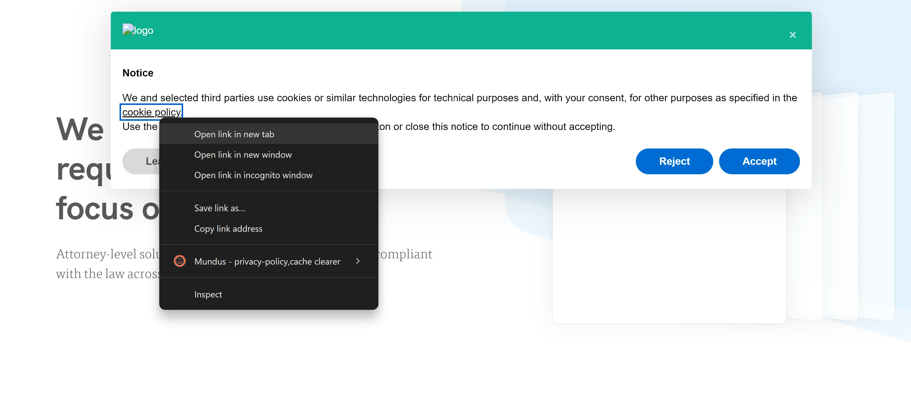
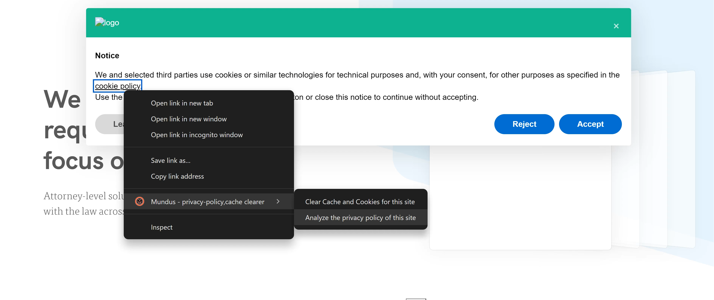
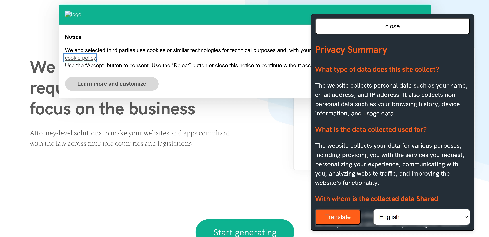
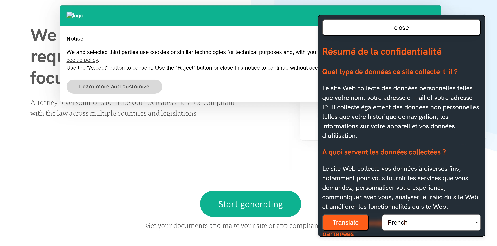
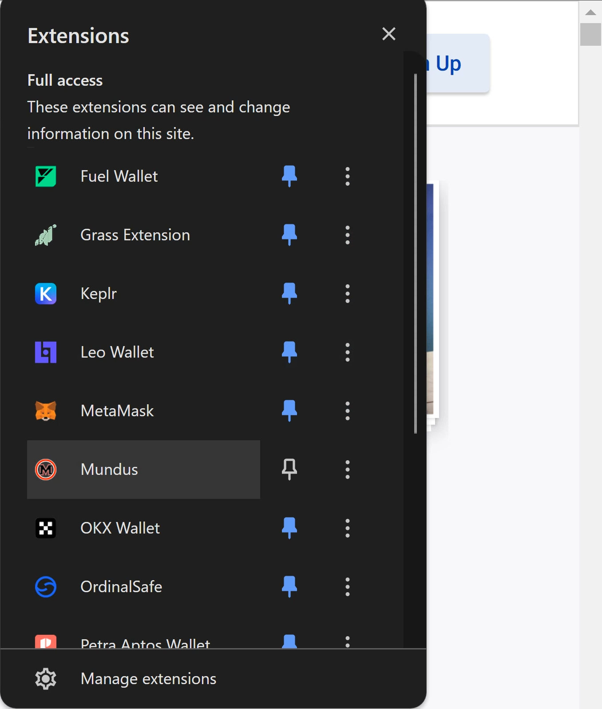
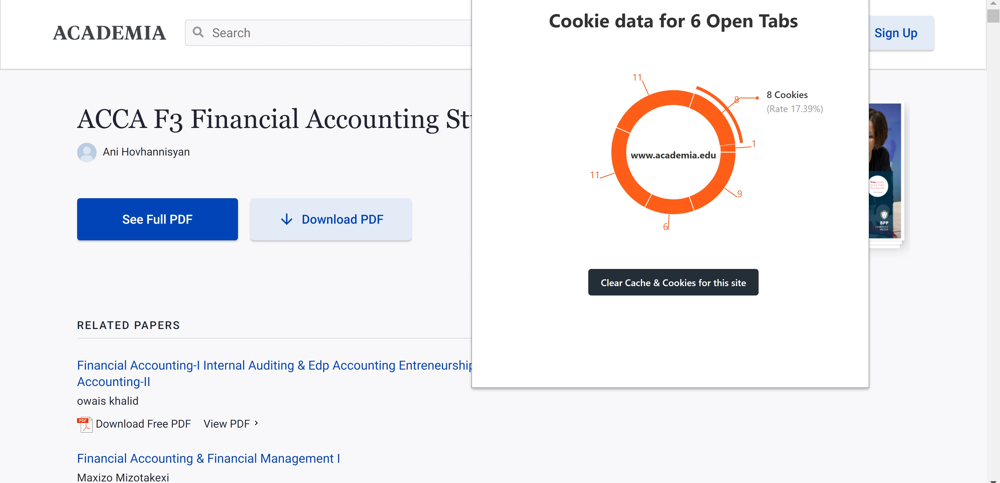

# Mundus Chrome Extension

## Overview

Mundus is a Chrome extension designed to enhance user data privacy by summarizing data policies, terms and conditions, translating these documents into User's preferred language and clearing cookies and cache of websites. Our goal is to make it easier for users to understand the privacy implications of the websites they visit and maintain their privacy online.

## Features

- **Summarize Data Policies**: Automatically generate concise summaries of lengthy data policies and terms and conditions.
- **Translate Documents**: Translate data policies and terms and conditions into various languages.
- **Clear Cookies and Cache**: Easily clear cookies and cache for any website to enhance privacy and security.

*Summary and Translation of a data policy*

*Cookie and cache clearing*
