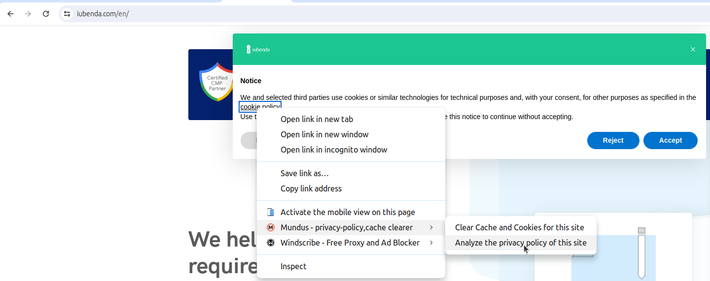
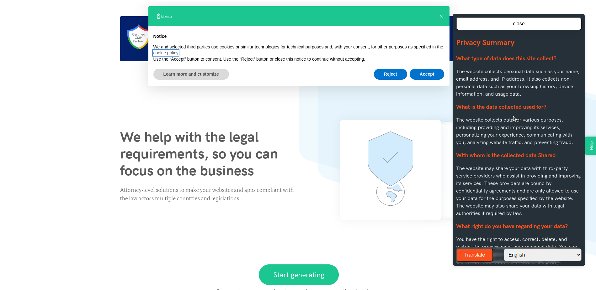
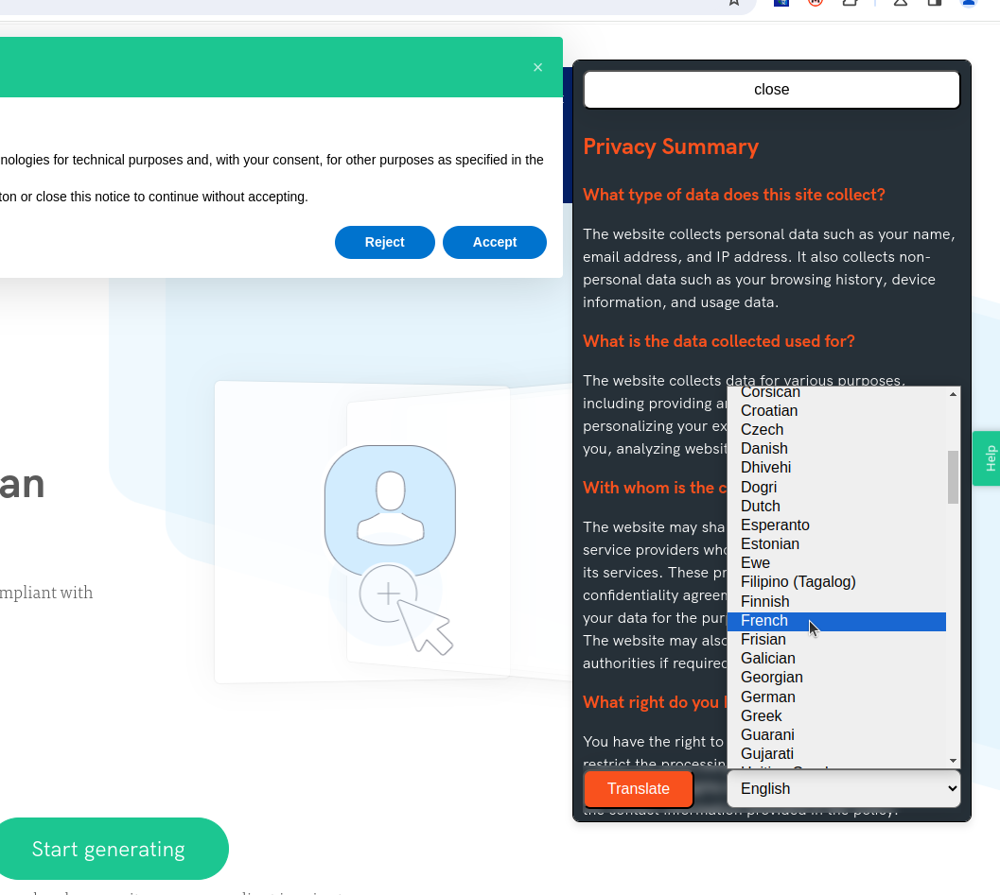
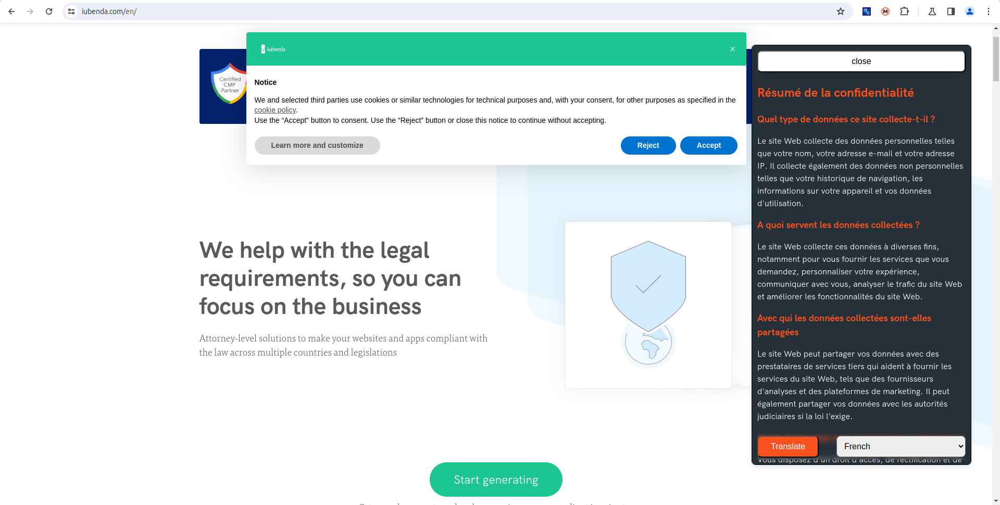

# Mundus Chrome Extension

## Overview

Mundus is a Chrome extension designed to enhance user data privacy by summarizing data policies, terms and conditions, translating these documents into User's preferred language and clearing cookies and cache of websites. Our goal is to make it easier for users to understand the privacy implications of the websites they visit and maintain their privacy online.

## Features

- **Summarize Data Policies**: Automatically generate concise summaries of lengthy data policies and terms and conditions.
- **Translate Documents**: Translate data policies and terms and conditions into various languages.
- **Clear Cookies and Cache**: Easily clear cookies and cache for any website to enhance privacy and security.

## Installation

You require [Node.js](https://nodejs.org/) v10+ to build the extension.
You also require a GeminiAI Api key, Obtain one from https://ai.google.dev/gemini-api/docs/api-key

Clone the Project, Install the dependencies and devDependencies and build.

```sh
git clone https://github.com/Damilarr/mundus
cd mundus
npm i
```

Inside the .env file add

```sh
VITE_GOOGLE_API_KEY=yourApiKey
```

Save the file then

```sh
npm run build
```

## Usage

To analyze privacy policy of websites, simply right click on the link to the privacy policy of that site , a popup menu appears which displays the summary shortly after.


When the policy has been summarized and displayed, the summary can be translated into different languages and displayed.



## Development

Want to contribute? Great!
Fork and clone the project, make your changes and create a pull request.

**Free Software, Hell Yeah!**
